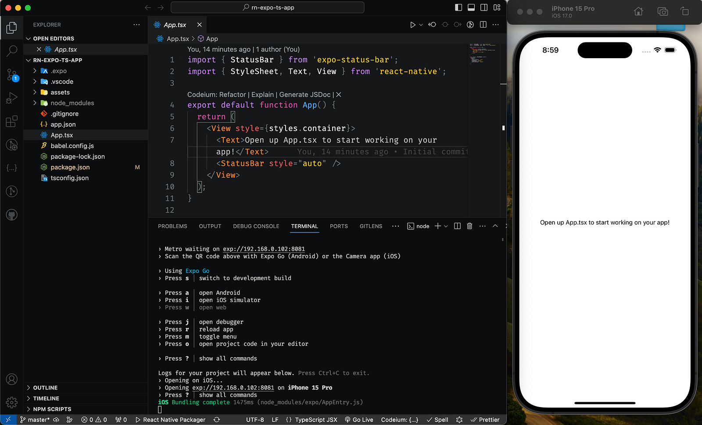
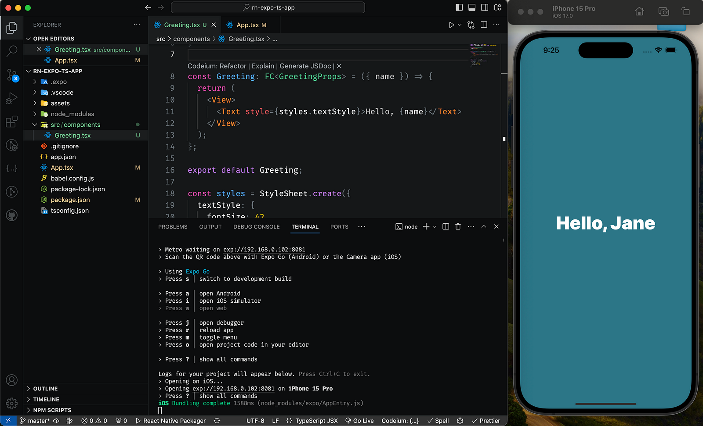
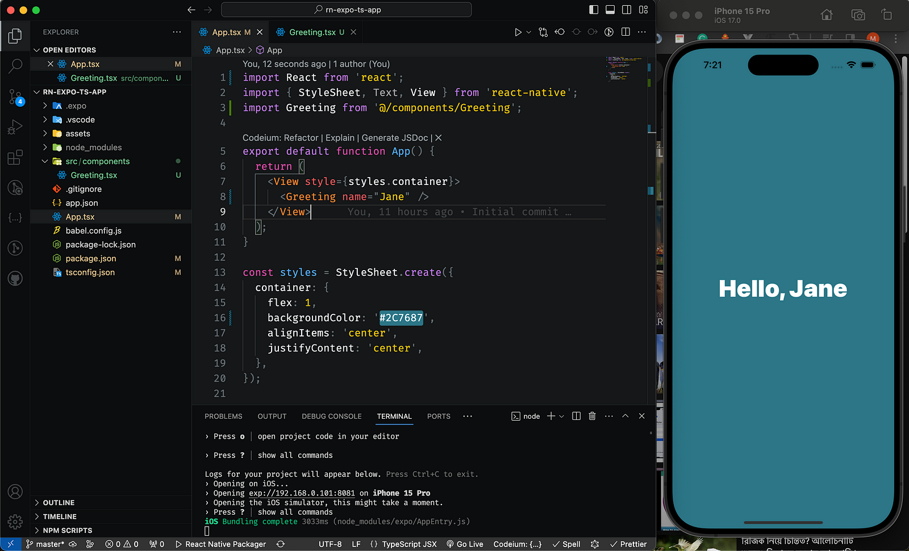
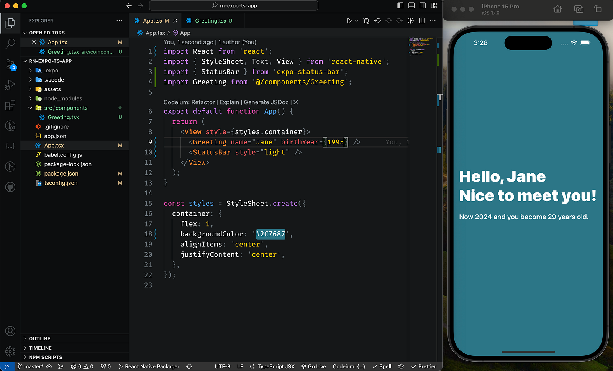

# Types Harmony in a React Native & Expo App

Types are a way of describing the shape and behavior of data in our code. They can help us avoid common errors, such as passing the wrong arguments to a function, accessing a property that doesn't exist, or assigning a value of the wrong type to a variable. Types can also make our code more readable and maintainable, as they document the expectations and assumptions of our code.

## Two ways to add Types

There are two popular options for adding types to a React Native & Expo app: **Flow** and **TypeScript**. Both are extensions of JavaScript that allow us to annotate our code with type definitions and check them for errors. However, they have some differences in their syntax, features, and ecosystem.

## Flow

[Flow is a type checker for JavaScript](https://flow.org/) developed by **Facebook**. It aims to build a deeper understanding of our code and perform an interprocedural analysis, which means it can track data flow across different modules and functions. Flow has a robust ability to infer types, which means it can detect many bugs without requiring explicit type annotations. Flow also integrates seamlessly with Babel and the existing infrastructure of React Native & Expo.

## TypeScript

[TypeScript is a programming language that compiles JavaScript](https://www.typescriptlang.org/) developed by **Microsoft**. It provides additional language features, such as interfaces, enums, generics, and decorators, which are unavailable in standard JavaScript. TypeScript integrates great with popular tools and libraries like Vite, Expo, VS Code, etc. TypeScript also has a larger and more active community than Flow, which means more support and resources.

@wcandillon wrote an article in the past about the [Flow vs TypeScript](https://levelup.gitconnected.com/flow-vs-typescript-in-react-my-two-cents-d4d0c657d236) that has now become older, and some parts of the discussion have been changed over time in the React Native community, but the core message of that article is still valuable.

## Project Setup with TypeScript

Creating a new React Native & Expo app with TypeScript has never been easy before. just open your terminal and run the below command:

```bash
# create a new react-native & expo app with typescript
npx create-expo-app -t expo-template-blank-typescript

# Termanial will ask for a name for our project
# We can name it: "rn-expo-ts-app"
# After successful installation navigate to the project direcotry
cd rn-expo-ts-app

# open vs code
code .
```

For npm, update the `package.json` file to add the following `script`:

```json
{
  "scripts": {
    "ts:check": "tsc"
  }
}
```

Then, run the following command:

```bash
# type check
npm run ts:check
```

**Additionally, When we create new source files in our project. we should have to use the .ts extension or the .tsx if the file includes React components.**

## Run the App

```bash
# open the terminal and run the app
npx expo start

# Press "a" to open Android Emulator
# Press "i" to open iOS simulator or
# Scan the QR code with Expo Go (Android) or the Camera app (iOS)
```



## Building Components with TypeScript

We successfully created a new React Native & Expo app project. Now we will create a simple component to get a hands-on preview of how we can easily use TypeScript in our app codebase:

```bash
# create a new folder called "src" and navigate there
mkdir src && cd src

# create a new folder inside "src" named "components" and navigate into it
mkdir components && cd components

# create a tsx component file named "Greeting.tsx"
touch Greeting.tsx
```

Update the the `Greeting.tsx` by adding the following code:

```jsx
import React, { FC } from 'react';
import { StyleSheet, Text, View } from 'react-native';

interface GreetingProps {
  name: string;
}

const Greeting: FC<GreetingProps> = ({ name }) => {
  return (
    <View>
      <Text style={styles.textStyle}>Hello, {name}</Text>
    </View>
  );
};

export default Greeting;

const styles = StyleSheet.create({
  textStyle: {
    fontSize: 42,
    color: '#ffffff',
    fontWeight: '900',
  },
});
```

Also, replace the `App.tsx` as below:

```jsx
import React from 'react';
import { StyleSheet, Text, View } from 'react-native';
import Greeting from './src/components/Greeting';

export default function App() {
  return (
    <View style={styles.container}>
      <Greeting name="Jane" />
    </View>
  );
}

const styles = StyleSheet.create({
  container: {
    flex: 1,
    backgroundColor: '#2C7687',
    alignItems: 'center',
    justifyContent: 'center',
  },
});
```

Save and check the UI:



## Path Aliases for better imports

Everything is fine and working as expected. But, if we wish to add path aliases to import our components like: `import Greeting from '@/components/Greeting'` instead of `import Greeting from './src/components/Greeting'` then we have to add the following configuration to our `tsconfig.json`:

```json
{
  "extends": "expo/tsconfig.base",
  "compilerOptions": {
    "strict": true,
    "baseUrl": ".",
    "paths": {
      "@/*": ["src/*"]
    }
  }
}
```

If we want to specify which files should pass the checkpoint, we can tell TypeScript explicitly by updating the config as below:

```json
{
  "extends": "expo/tsconfig.base",
  "compilerOptions": {
    "strict": true,
    "baseUrl": ".",
    "paths": {
      "@/*": ["src/*"]
    }
  },
  "include": ["**/*.ts", "**/*.tsx"]
}
```

Re-import the `Greeting.tsx` component in `App.tsx` and that will be like:

```jsx
import React from 'react';
import { StyleSheet, Text, View } from 'react-native';
import Greeting from '@/components/Greeting';

export default function App() {
  return (
    <View style={styles.container}>
      <Greeting name="Jane" />
    </View>
  );
}

const styles = StyleSheet.create({
  container: {
    flex: 1,
    backgroundColor: '#2C7687',
    alignItems: 'center',
    justifyContent: 'center',
  },
});
```

**Note: if we change anything in `tsconfig.json` file then we have to restart the Expo CLI**

That's all, we are done 🚀



## Play more with TypeScript

Let's update our greeting components to play more with TypeScript:
Currently, our `<Greeting />` component only takes a `name` props and displays it. Let's add another prop to take the person's age and display it too.

Updated `Greeting.tsx` as follows:

```jsx
import React, { FC } from 'react';
import { StyleSheet, Text, View } from 'react-native';

interface GreetingProps {
  name: string;
  birthYear: number;
}

const Greeting: FC<GreetingProps> = ({ name, birthYear }) => {
  const currentYear = new Date().getFullYear();
  const age = currentYear - birthYear;

  return (
    <View style={styles.wrapper}>
      <Text style={styles.textStyle}>Hello, {name}</Text>
      <Text style={styles.textStyle}>Nice to meet you!</Text>
      <Text style={[styles.textStyle, styles.ageTextStyle]}>
        Now {currentYear} and you become {age} years old.
      </Text>
    </View>
  );
};

export default Greeting;

const styles = StyleSheet.create({
  wrapper: {
    paddingHorizontal: 10,
  },
  textStyle: {
    fontSize: 42,
    color: '#ffffff',
    fontWeight: '900',
  },
  ageTextStyle: {
    marginTop: 20,
    fontSize: 18,
    fontWeight: '600',
  },
});
```

Pass `birthYear` props from `App.tsx` to the `<Greeting />` component:

```jsx
import React from 'react';
import { StyleSheet, Text, View } from 'react-native';
import { StatusBar } from 'expo-status-bar';
import Greeting from '@/components/Greeting';

export default function App() {
  return (
    <View style={styles.container}>
      <Greeting name="Jane" birthYear={1995} />
      <StatusBar style="light" />
    </View>
  );
}

const styles = StyleSheet.create({
  container: {
    flex: 1,
    backgroundColor: '#2C7687',
    alignItems: 'center',
    justifyContent: 'center',
  },
});
```

The final preview:



## Additional Resources

- A good place to start learning TypeScript is the official [TypeScript Handbook](https://www.typescriptlang.org/docs/handbook/intro.html)
- React (Native) components with TypeScript, refer to the handy [React TypeScript cheat sheet](https://github.com/typescript-cheatsheets/react) for common situations and patterns.
- [Expo Docs using the TypeScript](https://docs.expo.dev/guides/typescript/) section for the latest and most accurate information.

## The Real Journey Begins Here...

You've taken your first steps on the path of mastering React Native and Expo with TypeScript. Remember, this isn't just about adding types to your code; it's about unlocking a new level of clarity, confidence, and efficiency in your development journey.

But hold on, your journey isn't over yet. This is just the launchpad! As you build more and more apps, you'll discover new nuances of TypeScript, explore advanced features like generics and decorators, and dive deeper into the Expo ecosystem. Remember, consistency is key. Practice, experiment, break things (and fix them!), and don't be afraid to ask for help. The React Native & Expo communities are vibrant and welcoming, full of experienced developers ready to share their knowledge.

## Contribution

Please review and share your feedback. You may also report issues or make contributions to help the community.
